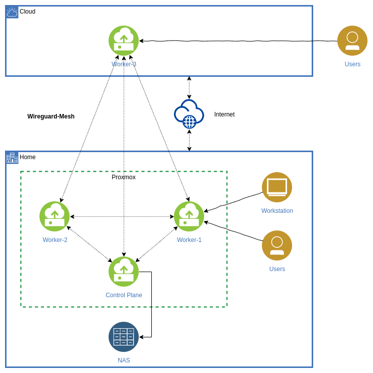

# Kubernetes Cluster with Wireguard Mesh

Provision a Kubernetes Cluster that communicates via a Wireguard Mesh.

## Example Architecture

<p align="center"></p>

The Control Plane and Worker 1 and 2 are running in virtual machines on a local [Proxmox](https://proxmox.com/en/) server. Additional there is one worker hosted at a cloud provider. All nodes are connected via a Wireguard Mesh, which is automatically configured via an [Ansible](https://www.ansible.com/) playbook. All nodes are provisionied via the playbook as well and are running Ubuntu 20.04.

Worker-1 and Worker-3 are configured as LoadBalancers for the ingress. Inside the home network, the domains are being resolved to the Worker-1. The public DNS server resolves the domains to Worker-3.

Additionally, a NAS server outside of the wireguard mesh is beeing used for PVCs in combination with the [NFS Client Provisioner](https://github.com/helm/charts/tree/master/stable/nfs-client-provisioner). It is accessible via the controlplane with the usage of NAT rules.

## Instructions

### Step 0: Install requirements

The playbooks in this repository are using the [Ansible Kubernetes community collection](https://github.com/ansible-collections/community.kubernetes), so you have to install it from the Ansible Galaxy:

```
$ ansible-galaxy collection install -r requirements.yml
```

The collection needs the Openshift Python library to be installed:

```
$ pip3 install openshift
```

### Step 1: Generate Wireguard keys

With the wireguard tools installed, you have to run the following command for each cluster node, to generate the private and public key for the wireguard interface:

```
$ wg genkey | tee peer_A.key | wg pubkey > peer_A.pub
```

### Step 2: Bootstrap Kubernetes Cluster

For each host, you have to provide a host vars file with the following variables:

```yaml
wireguard:
  private_ip: <wireguard private ip (e.g. 10.240.0.1)>
  private_key: <wireguard private key>
  public_key: <wireguard_public key>
is_nfs_router: no
```

You should use a /16 subnet for the wireguard private ips (e.g. 10.240.0.0/16). If the host should act as a router to the nfs storage, you have to set the variable `is_nfs_router` to `yes`. The bootstrap playbook uses the inventory hostname as the public endpoint for Wireguard, so make shure that port 51820/udp is accessible for each node of the cluster.

Additionally, you need to define the following group vars for the all group:

```
nfs_server: <ip of the nfs server>
nfs_path: <path of the nfs mount>
letsencrypt_email: <email address for letsencrypt>
```

Now you can bootstrap the cluster nodes:

```
ansible-playbook -i inventory.yaml bootstrap.yml
```

This will upgrade the servers and install Docker, kubeadm and the Wireguard configuration. After that, you should be able to ping all nodes inside the cluster.

### Step 3: Initialize the cluster

Note: This step has to be done manually, currently.

As kubeadm uses the IP of the interface with the default route as the node IP, you have to provide the node IP of the wireguard interface to the kubeadm commands. [As there is no `--node-ip` option available](https://github.com/kubernetes/kubeadm/issues/203), [you have to provide a join and init configuration instead](https://medium.com/@aleverycity/kubeadm-init-join-and-externalip-vs-internalip-519519ddff89):

```yaml
apiVersion: kubeadm.k8s.io/v1beta2
kind: InitConfiguration
localAPIEndpoint:
  advertiseAddress: "<wireguard ip>"
nodeRegistration:
  kubeletExtraArgs:
    node-ip: "<wireguard ip>"
---
apiVersion: kubeadm.k8s.io/v1beta2
kind: ClusterConfiguration
networking:
  podSubnet: 10.244.0.0/16
```

Now you have to run `kubeadm init --config <join-conf-filename>.yml` on the node that should act as the control plane.

The join configuration has to be like this:

```yaml
apiVersion: kubeadm.k8s.io/v1beta2
kind: JoinConfiguration
discovery:
  bootstrapToken:
    apiServerEndpoint: "<control plane ip>:6443"
    token: "<join token>"
    unsafeSkipCAVerification: true
nodeRegistration:
  kubeletExtraArgs:
    node-ip: "<wireguard ip>"
```

Of course, you have to edit the wireguard ip for each node. Now you can join the node with `kubeadm join --config <join-conf-filename>.yml`.

After that, you have to install flannel for pod networking. The flannel manifest has to be edited, [so that flannel uses the wireguard interface](https://stackoverflow.com/a/48755233/1408570) instead of the interface to the default gateway:

```yaml
[...]
      containers:
      - name: kube-flannel
        image: quay.io/coreos/flannel:v0.12.0-amd64
        command:
        - /opt/bin/flanneld
        args:
        - --ip-masq
        - --kube-subnet-mgr
        - --iface=wg0
        resources:
          requests:
            cpu: "100m"
            memory: "50Mi"
[...]
```

Now you have a working Kubernetes cluster that communicates via the Wireguard mesh!

### Step 4: (Optional) Deploy Nginx Ingress, Node Exporter, Cert Manager and NFS Client Provisioner

Wit the `deploy.yml` playbook, you are able to deploy the upper applications. You are able to skip some of them via `--skip-tags`. For the ingress controller, you should provid a list of external ips for the load balancer via the variable `ingress_external_ips`. The external ips should be the public ips of your cluster nodes. This playbook will be run on your local workstation, so you should have a working kube config on your machine.
